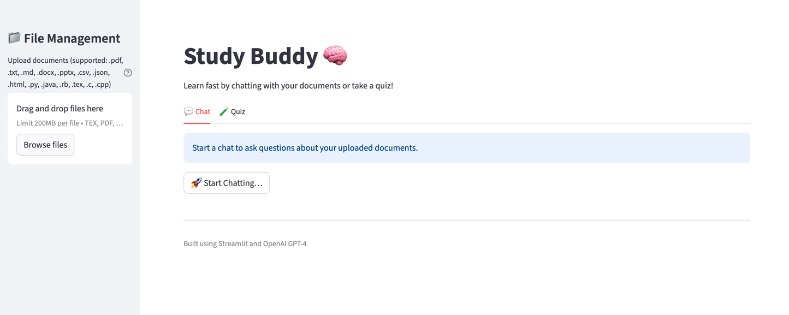
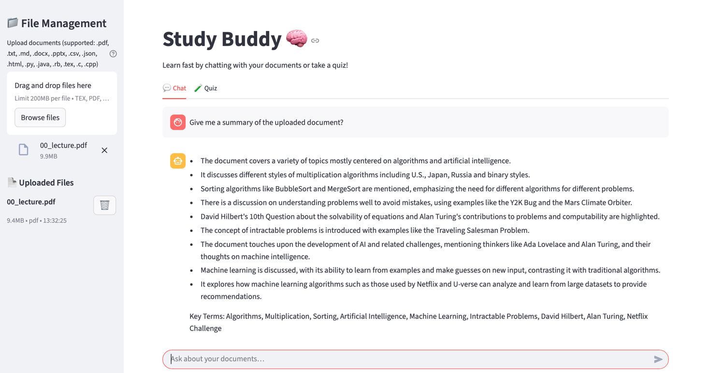
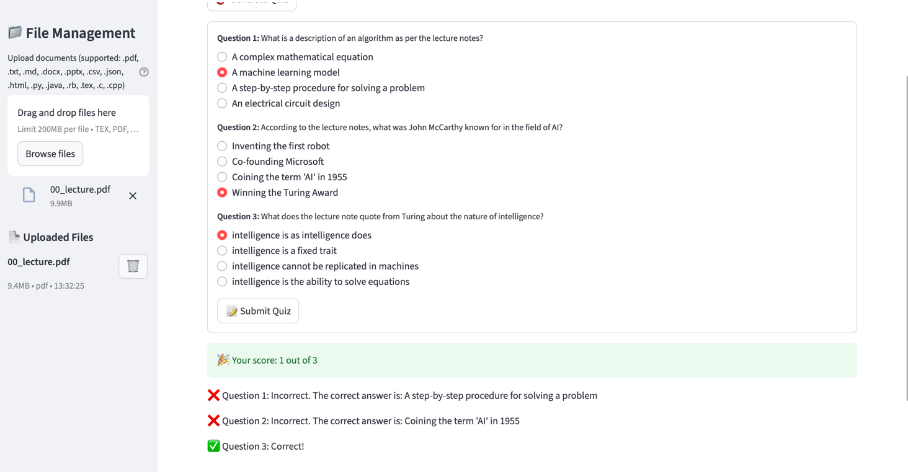

# Study Buddy 📚

> An AI-powered study assistant that helps you learn from your documents via interactive chat and auto-generated quizzes — with inline citations.



---

## ✨ Features
- 🔍 **Smart ingestion** — upload multiple PDFs, docs, slides, data files
- 💬 **Chat with your docs** — grounded answers with inline citations
- 🧠 **Quiz generation** — quick MCQs from one or many files
- ⚡ **Fast** — processes and retrieves in real time
- 🧱 **Modular** — clean, maintainable Python modules

---

## 🎥 Demo



---

## 🚀 Quick Start

### Prerequisites
- Python **3.8+** (3.10+ recommended)
- OpenAI API key
- Git

### Install & Run
```bash
# 1) Clone
git clone https://github.com/enkela1/studybuddy.git
cd studybuddy

# 2) (optional) create and activate a virtual env
python -m venv .venv
source .venv/bin/activate        # Windows: .venv\Scripts\activate

# 3) Install dependencies
pip install -r requirements.txt

# 4) Configure environment
cp .env.example .env
# then edit .env and set:
# OPENAI_API_KEY=sk-...

# 5) Launch
streamlit run main.py
````

Open: [http://localhost:8501](http://localhost:8501)

---

## 📁 Project Structure

```
studybuddy/
├── main.py                # Streamlit UI
├── config.py              # Constants & prompts
├── utils.py               # Helpers (citations, JSON parsing, etc.)
├── openai_client.py       # OpenAI client wrappers (Assistants, Vector Stores)
├── file_manager.py        # Uploads & vector-store bookkeeping
├── requirements.txt
├── .env.example
├── .gitignore
├── README.md
└── assets/                # Screenshots used in README
```

---

## 🎯 How to Use

1. **Upload documents** (PDF, TXT, DOCX, PPTX, CSV, JSON, HTML, code).
2. **Chat** to ask questions about the uploaded content.
3. **Generate a quiz** (3 MCQs by default) covering the uploaded files.

---

## 🛠️ Tech Stack

* **Frontend:** Streamlit
* **AI:** OpenAI GPT-4 family (Assistants API)
* **Retrieval:** `file_search` + Vector Stores
* **Language:** Python

---

## 📋 Supported File Types

| Category      | Extensions                                  |
| ------------- | ------------------------------------------- |
| **Documents** | `.pdf`, `.txt`, `.md`, `.docx`, `.pptx`     |
| **Data**      | `.csv`, `.json`                             |
| **Web**       | `.html`                                     |
| **Code**      | `.py`, `.java`, `.rb`, `.tex`, `.c`, `.cpp` |

*Max size per file:* **200MB** (configurable in `config.py`)

---

## 📄 License

MIT

````